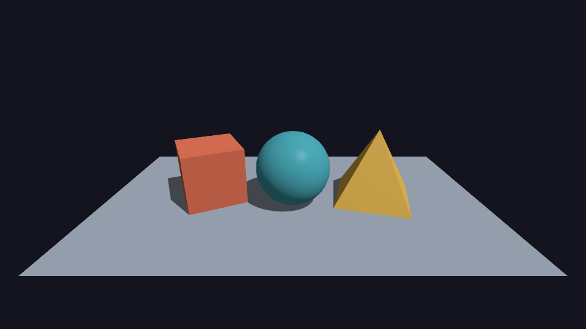

# Software renderer

A little C++ project for playing with 3D graphics. The CPU draws the scene,
and SDL2 puts it in a window. Fly around, move a few shapes, play with shadows,
or open your own model.



## Try it

You'll need a C++23 compiler, CMake, and SDL2 development files
(`libsdl2-dev` on Debian/Ubuntu).

From the project folder:

```sh
./run.sh --width 1280 --height 720 --shadows
```

The script builds the project and opens a scene with a cube, a sphere, and a
pyramid. It uses an optimized Release build by default. Plain `./run.sh` works
too; the options above pick 720p and turn on shadows.

The shrimp has its own scene:

```sh
./run.sh --scene shrimp
```

You can also open an OBJ file with `./run.sh --model path/to/model.obj`.

## Move things around

| Keys | What they do |
| --- | --- |
| Hold right mouse button | Look around |
| WASD | Move the camera |
| Space / Left Ctrl | Move up / down |
| Left Shift | Move faster |
| Tab | Select the next object |
| Arrow keys | Move the selected object along the floor |
| Q / E | Rotate it |
| PageUp / PageDown | Make it bigger / smaller |
| F1 | Cycle through views of the scene |
| F2 | Toggle shadows |
| F3 | Toggle smoother edges |
| Escape | Close the window |

The floor is selectable too. The counter in the corner shows your FPS and
which object is selected.

## More to play with

- [Scenes and your own models](docs/scenes.md)
- [Lights, textures, and smoother edges](docs/shading-quality.md)
- [If it feels slow](docs/primitives-performance.md)
- [Tinkering with the code](docs/code-style.md)

For all command-line options, run `./run.sh --help`.
